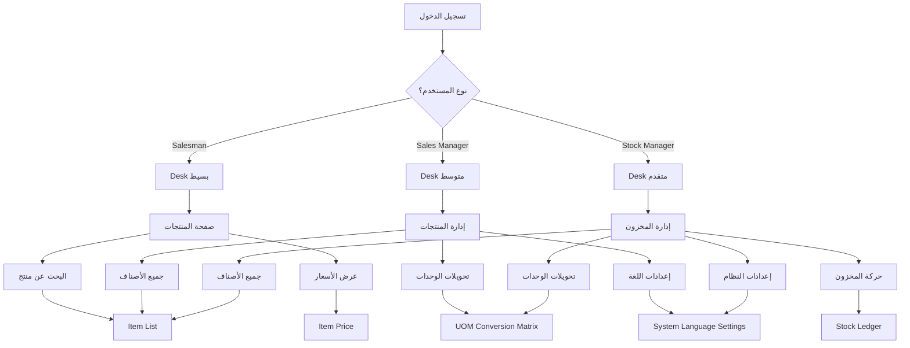

# 🧭 دليل التنقل والوصول للصفحات (Client Navigation Guide)

## 📱 كيفية الوصول لصفحات Module 2

### 1. بعد تسجيل الدخول (Login)

عندما يقوم العميل بتسجيل الدخول، سيظهر له **Desk** (لوحة التحكم الرئيسية):

```
┌─────────────────────────────────────────────────────────────┐
│  Meena Mobile Sales System                                  │
├─────────────────────────────────────────────────────────────┤
│                                                              │
│  🔍 Search...                                               │
│                                                              │
│  ┌───────────┐  ┌───────────┐  ┌───────────┐              │
│  │  Stock    │  │  Selling  │  │  Buying   │              │
│  │  Module   │  │  Module   │  │  Module   │              │
│  └───────────┘  └───────────┘  └───────────┘              │
│                                                              │
│  ┌─────────────────────────────────────────────────────┐   │
│  │  Recent Documents                                    │   │
│  │  • Item - TEST-001                                   │   │
│  │  • Sales Invoice - INV-001                           │   │
│  └─────────────────────────────────────────────────────┘   │
│                                                              │
│  ┌─────────────────────────────────────────────────────┐   │
│  │  Masters                                             │   │
│  │  • Item                                              │   │
│  │  • Customer                                          │   │
│  │  • UOM                                               │   │
│  └─────────────────────────────────────────────────────┘   │
└─────────────────────────────────────────────────────────────┘
```

---

### 2. الوصول لصفحات Module 2

#### الطريقة الأولى: من خلال القوائم (Menus)

```
1. انقر على "Stock" في الشريط الجانبي
2. ستظهر القائمة الفرعية:
   ├── Items
   │   ├── Item              ← (إنشاء/عرض الأصناف)
   │   ├── Item Group        ← (مجموعات الأصناف)
   │   └── Item Price         ← (أسعار الأصناف)
   │
   ├── Masters
   │   ├── Item              ← (قائمة الأصناف)
   │   ├── UOM               ← (وحدات القياس)
   │   └── Brand             ← (العلامات التجارية)
   │
   └── Reports
       ├── Stock Summary     ← (تقرير المخزون)
       └── Stock Ledger      ← (سجل المخزون)
```

#### الطريقة الثانية: من خلال البحث (Search)

```
1. اضغط "/" أو انقر في خانة البحث
2. اكتب اسم الصفحة:
   - "Item" للوصول للأصناف
   - "System Language Settings" للإعدادات
   - "UOM Conversion Matrix" لتحويلات الوحدات
3. اضغط Enter
```

#### الطريقة الثالثة: روابط مباشرة (Direct URLs)

```
http://127.0.0.1:8000/app/item                     ← قائمة الأصناف
http://127.0.0.1:8000/app/item/new                 ← صنف جديد
http://127.0.0.1:8000/app/system-language-settings ← إعدادات اللغة
http://127.0.0.1:8000/app/uom-conversion-matrix    ← تحويلات الوحدات
```

---

### 3. ترتيب الصفحات للعميل (Workspace Customization)

#### إنشاء Workspace مخصص

يمكنك إنشاء Workspace مخصص للعميل يحتوي على جميع صفحات Module 2:

```
الخطوات:
1. اذهب إلى: Settings > Workspace
2. اضغط "New"
3. أدخل البيانات:
   - Workspace Name: "Product Management"
   - Module: "Stock"
   - Icon: "box"
4. أضف الروابط:
   - Link: Item, Label: الأصناف
   - Link: System Language Settings, Label: إعدادات اللغة
   - Link: UOM Conversion Matrix, Label: تحويلات الوحدات
5. اضغط "Save"
```

#### إضافة اختصارات (Shortcuts)

```
من Desk > Product Management Workspace:

┌─────────────────────────────────────────────────────────────┐
│  📦 Product Management                                      │
├─────────────────────────────────────────────────────────────┤
│                                                              │
│  Shortcuts                                                   │
│  ┌─────────────────────┐  ┌─────────────────────┐         │
│  │  📝 Item            │  │  ⚙️ Language        │         │
│  │  Create New Item    │  │  Settings           │         │
│  └─────────────────────┘  └─────────────────────┘         │
│  ┌─────────────────────┐  ┌─────────────────────┐         │
│  │  🔄 UOM Conversion  │  │  📊 Item List       │         │
│  │  Matrix             │  │                     │         │
│  └─────────────────────┘  └─────────────────────┘         │
│                                                              │
│  Quick Links                                                 │
│  • Item List                                                │
│  • Item Groups                                             │
│  • UOM List                                                │
│  • System Language Settings                                │
└─────────────────────────────────────────────────────────────┘
```

---

### 4. تخصيص واجهة العميل (Client UI Customization)

#### إضافة الصفحات للمفضلة (Favorites)

```
الخطوات:
1. افتح أي صفحة (مثلاً: Item List)
2. انقر على النجمة ⭐ في أعلى الصفحة
3. ستظهر الصفحة في "Favorites" في Desk
```

#### إنشاء قوائم مخصصة (Custom Menus)

```
من: Settings > Menu Items

إنشاء قائمة "إدارة المنتجات":
1. Parent: Stock
2. Menu Item Name: Product Management
3. Menu Type: Module
4. Module: Stock
```

---

### 5. الصفحة الرئيسية للعميل (Landing Page)

#### إعادة توجيه بعد Login

```python
# في hooks.py
# home_page = "product_management"  # الصفحة الافتراضية بعد Login
```

#### إنشاء Page مخصصة

```
apps/base_meena/base_meena/page/product_management/
├── __init__.py
├── product_management.py
├── product_management.html
├── product_management.css
└── product_management.js
```

محتوى `product_management.html`:

```html
<div class="product-management-container">
    <h1>إدارة المنتجات</h1>
    
    <div class="quick-actions">
        <a href="/app/item/new" class="action-card">
            <i class="fa fa-plus"></i>
            <h3>صنف جديد</h3>
            <p>إنشاء صنف جديد</p>
        </a>
        
        <a href="/app/item" class="action-card">
            <i class="fa fa-list"></i>
            <h3>قائمة الأصناف</h3>
            <p>عرض جميع الأصناف</p>
        </a>
        
        <a href="/app/uom-conversion-matrix" class="action-card">
            <i class="fa fa-exchange"></i>
            <h3>تحويلات الوحدات</h3>
            <p>إدارة تحويلات UOM</p>
        </a>
        
        <a href="/app/system-language-settings" class="action-card">
            <i class="fa fa-language"></i>
            <h3>إعدادات اللغة</h3>
            <p>تغيير لغة النظام</p>
        </a>
    </div>
</div>
```

---

### 6. ترتيب الصفحات حسب الدور (Role-Based Access)

#### للبائع (Salesman)

```
Desk للبائع:
├── 🛒 المبيعات
│   ├── طلب مبيعات جديد
│   ├── عملاء
│   └── فواتير
├── 📦 المنتجات
│   ├── البحث عن منتج
│   └── عرض الأسعار
└── ⚙️ الإعدادات
    └── تغيير اللغة
```

#### لمدير المبيعات (Sales Manager)

```
Desk لمدير المبيعات:
├── 📊 التقارير
│   ├── تقرير المبيعات
│   ├── تقرير العملاء
│   └── تقرير الأصناف
├── 📦 إدارة المنتجات
│   ├── جميع الأصناف
│   ├── تحويلات الوحدات
│   └── إعدادات اللغة
└── 🛒 المبيعات
    ├── جميع طلبات المبيعات
    └── جميع الفواتير
```

#### لمدير المخزون (Stock Manager)

```
Desk لمدير المخزون:
├── 📦 المخزون
│   ├── جميع الأصناف
│   ├── حركة المخزون
│   └── جرد المخزون
├── 🔄 تحويلات الوحدات
│   ├── مصفوفة التحويل
│   └── إضافة تحويل جديد
└── ⚙️ الإعدادات
    ├── إعدادات اللغة
    └── إعدادات المخزون
```

---

### 7. إضافة أزرار وصول سريع (Quick Access Buttons)

#### من خلال Home Page

```javascript
// في product_management.js
frappe.pages['product-management'].on_page_load = function(wrapper) {
    var page = frappe.ui.make_app_page({
        parent: wrapper,
        title: 'إدارة المنتجات',
        single_column: true
    });
    
    // إضافة أزرار سريعة
    page.add_button({
        label: 'صنف جديد',
        action: () => frappe.set_route('Item', 'new'),
        icon: 'fa-plus'
    });
    
    page.add_button({
        label: 'تحويل وحدة',
        action: () => frappe.set_route('uom-conversion-matrix', 'new'),
        icon: 'fa-exchange'
    });
}
```

---

### 8. خريطة التنقل الكاملة (Navigation Map)



---

### 9. روابط سريعة للوصول

| الصفحة | الرابط المباشر | من القائمة |
|--------|---------------|-----------|
| قائمة الأصناف | `/app/item` | Stock > Items > Item |
| صنف جديد | `/app/item/new` | Stock > Items > Item > New |
| إعدادات اللغة | `/app/system-language-settings` | Stock > Settings |
| تحويلات الوحدات | `/app/uom-conversion-matrix` | Stock > Masters |
| وحدات القياس | `/app/uom` | Stock > Masters > UOM |
| مجموعات الأصناف | `/app/item-group` | Stock > Masters > Item Group |

---

### 10. تخصيص الشريط الجانبي (Sidebar Customization)

#### إضافة شعار (Logo)

```css
/* في force_rtl.css */
.sidebar .navbar-brand img {
    max-height: 40px;
}
```

#### تغيير الألوان

```css
/* تخصيص ألوان الشريط الجانبي */
.sidebar {
    background: linear-gradient(180deg, #1a237e 0%, #283593 100%);
}

.sidebar .sidebar-menu > li > a {
    color: #ffffff;
}
```

---

## 🎯 ملخص سريع

### للوصول السريع:
1. **Item List**: Stock > Items > Item
2. **New Item**: Stock > Items > Item > New
3. **Language Settings**: Stock > Settings > System Language Settings
4. **UOM Conversion**: Stock > Masters > UOM Conversion Matrix

### للوصول المباشر:
1. اضغط `/` للبحث
2. اكتب اسم الصفحة
3. اضغط Enter

### للتخصيص:
1. أنشئ Workspace مخصص
2. أضف صفحات للمفضلة
3. أنشئ Page مخصصة للعميل
