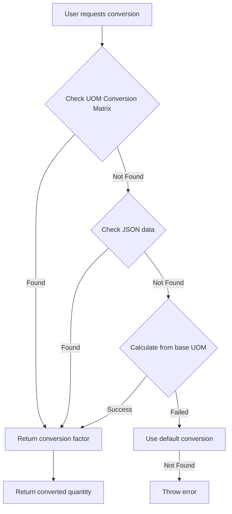
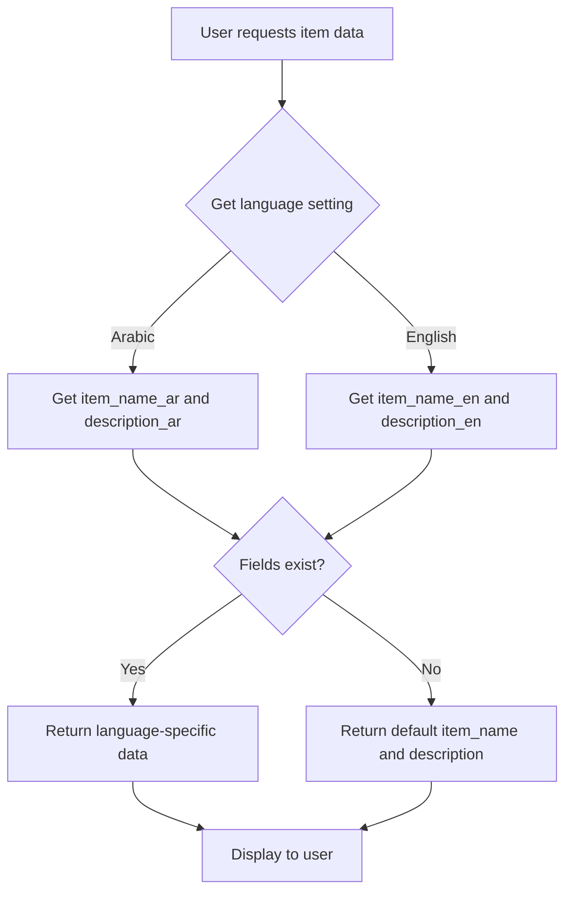

# 📦 Module 2: إدارة المنتجات (Product Master & UOMs) - خطة التنفيذ

## نظرة عامة

هذه خطة تنفيذية تفصيلية لـ Module 2 من نظام المبيعات الموبايل المتقدم، والذي يتضمن:
- **Task 6**: دعم تعدد اللغات (Multi-language Support)
- **Task 7**: نظام وحدات القياس الذكي (Smart UOMs)

---

## هيكل الملفات المقترح

```
apps/base_meena/
├── base_meena/
│   ├── doctype/
│   │   ├── system_language_settings/
│   │   │   ├── __init__.py
│   │   │   ├── system_language_settings.json
│   │   │   ├── system_language_settings.py
│   │   │   └── test_system_language_settings.py
│   │   └── uom_conversion_matrix/
│   │       ├── __init__.py
│   │       ├── uom_conversion_matrix.json
│   │       ├── uom_conversion_matrix.py
│   │       └── test_uom_conversion_matrix.py
│   └── product_management/
│       ├── __init__.py
│       ├── item_utils.py
│       └── uom_conversion.py
├── public/
│   └── js/
│       └── item_client_script.js
└── print_format/
    └── sales_invoice_multilingual.html
```

---

## Task 6: دعم تعدد اللغات

### 1. تعديل DocType: Item

**الحقول المطلوبة الإضافة:**

| Field Name | Type | Options | Label |
|------------|------|---------|-------|
| item_name_ar | Data | - | اسم الصنف بالعربية |
| item_name_en | Data | - | اسم الصنف بالإنجليزية |
| description_ar | Text | - | وصف الصنف بالعربية |
| description_en | Text | - | وصف الصنف بالإنجليزية |

**ملاحظة:** نظرًا لأن Item هو DocType موجود في ERPNext، سنقوم بإنشاء Custom Field باستخدام Frappe Customization API أو عن طريق إنشاء Custom DocPerm.

### 2. إنشاء DocType: System Language Settings

**الحقول:**

| Field Name | Type | Options | Label | Default |
|------------|------|---------|-------|---------|
| default_language | Select | ar, en | Default Language | ar |
| use_arabic_in_print | Check | - | Use Arabic in Print | 1 |
| use_arabic_in_invoices | Check | - | Use Arabic in Invoices | 1 |
| rtl_direction | Check | - | RTL Direction | 1 |

**الملفات:**
- `system_language_settings.json` - تعريف DocType
- `system_language_settings.py` - Controller class
- `__init__.py` - Package init

### 3. Python Script: item_utils.py

**الدوال المطلوبة:**

```python
# دالة الحصول على اسم الصنف حسب اللغة
get_item_name(item_code, language=None)

# دالة الحصول على وصف الصنف حسب اللغة
get_item_description(item_code, language=None)
```

### 4. Client Script: item_client_script.js

**الدوال المطلوبة:**

```javascript
// تبديل اللغة في نموذج Item
toggle_item_language(frm)

// تحديث عرض الاسم والوصف حسب اللغة
update_item_display(frm, language)
```

### 5. Print Format: Sales Invoice Multilingual

**الميزات:**
- دعم اللغة العربية والإنجليزية
- اتجاه RTL/LTR حسب الإعدادات
- عرض أسماء الأصناف وأوصافها حسب اللغة المختارة

---

## Task 7: نظام وحدات القياس الذكي

### 1. تعديل DocType: Item

**الحقول المطلوبة الإضافة:**

| Field Name | Type | Options | Label |
|------------|------|---------|-------|
| base_uom | Link | UOM | الوحدة الأساسية |
| base_conversion_factor | Float | - | معامل التحويل للوحدة الأساسية |
| default_uom | Link | UOM | الوحدة الافتراضية للعرض |
| uom_conversion_data | JSON | - | بيانات التحويل المحفوظة |

### 2. إنشاء DocType: UOM Conversion Matrix

**الحقول:**

| Field Name | Type | Options | Label |
|------------|------|---------|-------|
| item_code | Link | Item | الصنف |
| from_uom | Link | UOM | من الوحدة |
| to_uom | Link | UOM | إلى الوحدة |
| conversion_factor | Float | - | معامل التحويل |
| is_base_conversion | Check | - | هل هو تحويل للوحدة الأساسية |

**الملفات:**
- `uom_conversion_matrix.json` - تعريف DocType
- `uom_conversion_matrix.py` - Controller class
- `__init__.py` - Package init

### 3. Python Script: uom_conversion.py

**الدوال المطلوبة:**

```python
# حفظ معامل التحويل مع الحماية
save_uom_conversion(item_code, from_uom, to_uom, conversion_factor)

# الحصول على معامل التحويل مع الحماية
get_conversion_factor(item_code, from_uom, to_uom)

# الحصول على معامل التحويل من الوحدة للوحدة الأساسية
get_uom_to_base_factor(item_code, uom)

# تحويل الكمية بين وحدتين
convert_quantity(item_code, quantity, from_uom, to_uom)
```

### 4. Client Script: item_client_script.js (تحديث)

**الدوال المطلوبة:**

```javascript
// اختبار تحويل UOM
test_uom_conversion(frm)

// تحديث عرض الوحدات
update_uom_display(frm)

// حفظ معامل التحويل
save_conversion_factor(frm, from_uom, to_uom, factor)
```

---

## تحديث hooks.py

### تسجيل DocTypes

```python
# DocTypes
doctype_list = [
    "System Language Settings",
    "UOM Conversion Matrix"
]
```

### تسجيل APIs

```python
# API Methods
api_hooks = {
    "base_meena.product_management.item_utils.get_item_name": "get_item_name",
    "base_meena.product_management.item_utils.get_item_description": "get_item_description",
    "base_meena.product_management.uom_conversion.save_uom_conversion": "save_uom_conversion",
    "base_meena.product_management.uom_conversion.get_conversion_factor": "get_conversion_factor",
    "base_meena.product_management.uom_conversion.get_uom_to_base_factor": "get_uom_to_base_factor",
    "base_meena.product_management.uom_conversion.convert_quantity": "convert_quantity"
}
```

### تسجيل Doc Events (اختياري)

```python
# Doc Events
doc_events = {
    "Item": {
        "validate": "base_meena.product_management.item_utils.validate_item_uom",
        "on_update": "base_meena.product_management.item_utils.update_uom_cache"
    }
}
```

### تسجيل Client Scripts

```javascript
// Client Scripts
doctype_js = {
    "Item": "public/js/item_client_script.js"
}
```

---

## مخطط انسيابي لنظام UOM



---

## مخطط انسيابي لدعم اللغات



---

## خطوات التنفيذ

### المرحلة 1: إعداد البنية الأساسية
1. إنشاء مجلدات DocTypes الجديدة
2. إنشاء ملفات JSON للـ DocTypes
3. إنشاء ملفات Python Controllers
4. إنشاء ملفات __init__.py

### المرحلة 2: تطبيق Task 6 (دعم اللغات)
1. إنشاء DocType: System Language Settings
2. إنشاء item_utils.py مع دوال اللغة
3. إنشاء item_client_script.js مع دالة تبديل اللغة
4. إنشاء Print Format متعدد اللغات

### المرحلة 3: تطبيق Task 7 (نظام UOM الذكي)
1. إنشاء DocType: UOM Conversion Matrix
2. إنشاء uom_conversion.py مع دوال التحويل
3. تحديث item_client_script.js مع دوال UOM
4. إضافة منطق الحماية من حذف الوحدات

### المرحلة 4: التكامل والاختبار
1. تحديث hooks.py
2. تسجيل جميع APIs و Doc Events
3. اختبار دعم اللغات
4. اختبار نظام UOM
5. اختبار Print Format

---

## ملاحظات هامة

### 1. تعديل DocType الموجودة
بما أن Item هو DocType موجود في ERPNext، لدينا خياران:
- **الخيار A:** إنشاء Custom Fields عبر Frappe UI
- **الخيار B:** إنشاء Custom DocPerm في app الخاص بنا

### 2. الحماية من حذف الوحدات
نظام UOM الذكي يحتاج إلى حماية معاملات التحويل:
- حفظ معاملات التحويل في JSON field في Item
- استخدام UOM Conversion Matrix كواجهة أساسية
- الاحتفاظ بنسخة احتياطية في JSON

### 3. دعم اللغات
- استخدام System Language Settings كـ Single DocType
- السماح للمستخدم بتغيير اللغة من الـ UI
- تطبيق اللغة في Print Formats و Reports

### 4. التوافق مع ERPNext
- التأكد من عدم تعارض مع UOM Conversion الموجودة في ERPNext
- استخدام نفس الـ naming conventions
- اتباع معايير Frappe/ERPNext في البرمجة

---

## التحقق من الجودة

### قائمة التحقق لـ Task 6
- [ ] تم إنشاء System Language Settings DocType
- [ ] تم إضافة حقول اللغة لـ Item
- [ ] دوال get_item_name و get_item_description تعمل
- [ ] زر تبديل اللغة يعمل في Item Form
- [ ] Print Format يدعم اللغتين العربية والإنجليزية

### قائمة التحقق لـ Task 7
- [ ] تم إنشاء UOM Conversion Matrix DocType
- [ ] تم إضافة حقول UOM لـ Item
- [ ] دوال التحويل تعمل بشكل صحيح
- [ ] زر اختبار التحويل يعمل
- [ ] الحماية من حذف الوحدات تعمل

---

## المخاطر المحتملة والحلول

### المخطر 1: تعارض مع UOM Conversion الموجودة
**الحل:** استخدام namespace مختلف للدوال والتأكد من عدم الكتابة فوق الدوال الموجودة

### المخطر 2: أداء النظام مع JSON data
**الحل:** استخدام caching للبيانات المتكررة وفهرسة الحقول المهمة

### المخطر 3: صعوبة تعديل Item DocType
**الحل:** استخدام Custom Fields API أو إنشاء Child DocType للبيانات الإضافية

---

## الموارد والمراجع

### Frappe/ERPNext Documentation
- [Frappe DocType API](https://frappeframework.com/docs/v14/user/en/api/doctype)
- [Frappe Custom Fields](https://frappeframework.com/docs/v14/user/en/customization/custom-fields)
- [ERPNext Item DocType](https://docs.erpnext.com/docs/v14/user/en/stock/item)

### أمثلة على DocTypes في base_meena
- `meena_dock_settings` - مثال على Single DocType
- `meena_dock_module` - مثال على DocType بسيط

---

## التالي

بعد الموافقة على هذه الخطة، يمكن البدء في التنفيذ بالترتيب التالي:
1. إنشاء هيكل المجلدات
2. إنشاء DocTypes الجديدة
3. إنشاء Python Scripts
4. إنشاء Client Scripts
5. تحديث hooks.py
6. اختبار شامل
