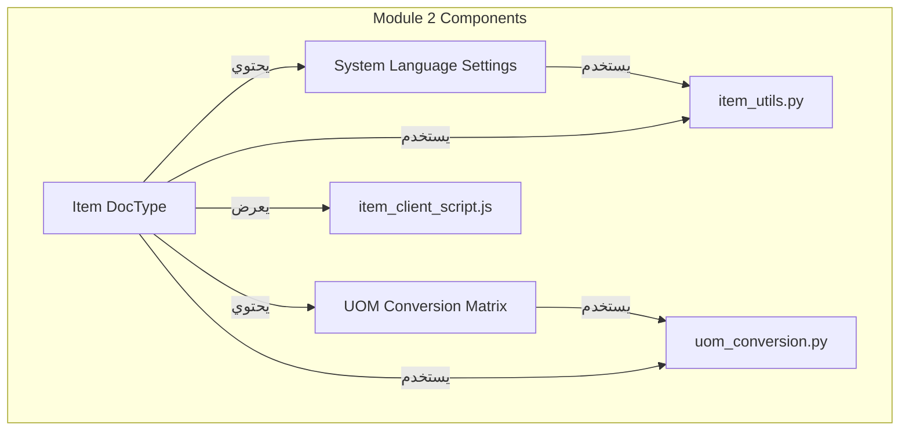
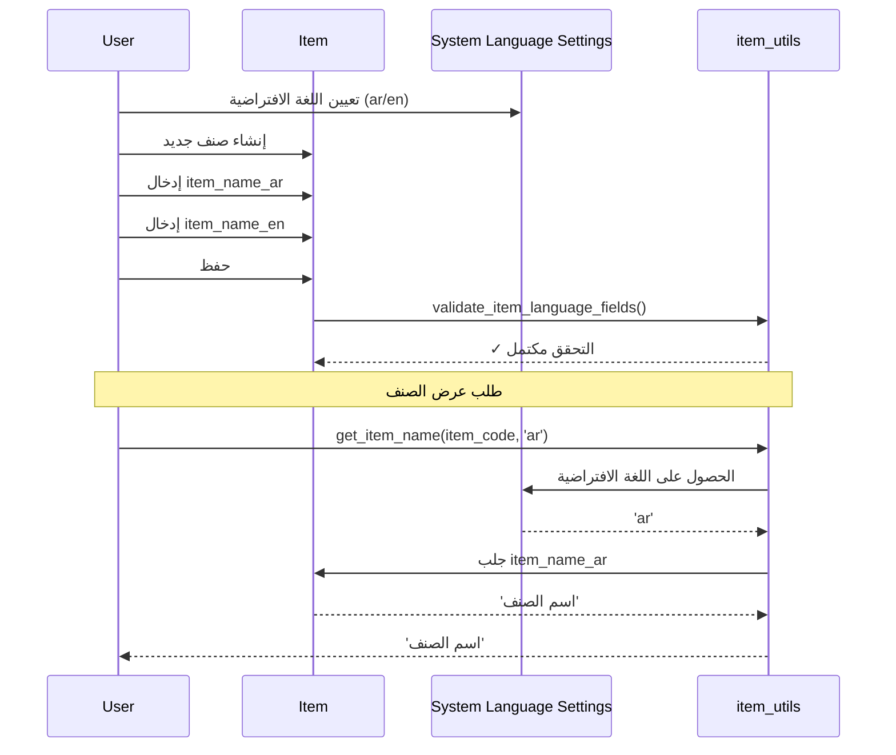
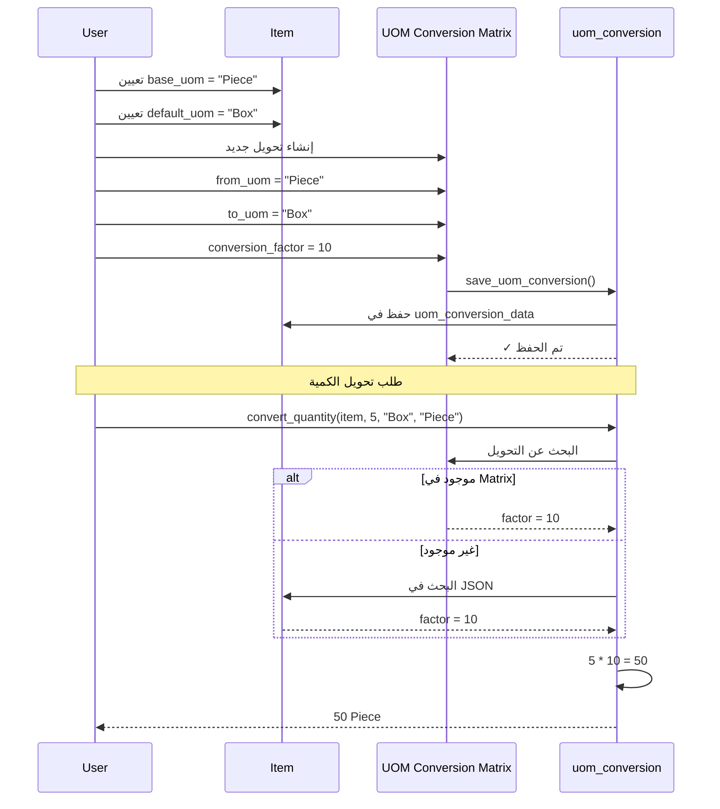

# 🏗️ البنية المعمارية الكاملة للمشروع
# Complete Project Architecture

بعد إضافة Module 2، إليك البنية المعمارية الكاملة لنظام المبيعات الموبايل المتقدم.

---

## 📊 نظرة عامة على المشروع

```
┌─────────────────────────────────────────────────────────────────────────────┐
│                    Meena Mobile Sales System                             │
│                     نظام المبيعات الموبايل المتقدم                        │
├─────────────────────────────────────────────────────────────────────────────┤
│                                                                             │
│  ┌──────────────────────────────────────────────────────────────────────┐  │
│  │                        Frappe Framework                              │  │
│  │                    (ERPNext + Custom Apps)                           │  │
│  └──────────────────────────────────────────────────────────────────────┘  │
│                                                                             │
│  ┌──────────────────────────────────────────────────────────────────────┐  │
│  │                         base_meena App                               │  │
│  │                      (Custom Application)                            │  │
│  ├──────────────────────────────────────────────────────────────────────┤  │
│  │  ┌─────────────┐  ┌─────────────┐  ┌─────────────┐  ┌─────────────┐ │  │
│  │  │  Module 1   │  │  Module 2   │  │  Module 3   │  │  Module 4   │ │  │
│  │  │  Dock UI    │  │  Products   │  │  Sales      │  │  Delivery   │ │  │
│  │  │            │  │  & UOMs     │  │  Process    │  │  Management │ │  │
│  │  └─────────────┘  └─────────────┘  └─────────────┘  └─────────────┘ │  │
│  └──────────────────────────────────────────────────────────────────────┘  │
│                                                                             │
└─────────────────────────────────────────────────────────────────────────────┘
```

---

## 📦 Module 2: إدارة المنتجات (Product Master & UOMs)

### المكونات الرئيسية

```
Module 2: Product Management
├── DocTypes
│   ├── System Language Settings (Single)
│   └── UOM Conversion Matrix (Document)
├── Python Modules
│   ├── item_utils.py
│   └── uom_conversion.py
├── Client Scripts
│   └── item_client_script.js
└── Print Formats
    └── sales_invoice_multilingual.html
```

### علاقات المكونات



---

## 🗂️ هيكل الملفات

```
apps/base_meena/
├── base_meena/
│   ├── doctype/
│   │   ├── system_language_settings/          # DocType: إعدادات اللغة
│   │   │   ├── __init__.py
│   │   │   ├── system_language_settings.json
│   │   │   ├── system_language_settings.py
│   │   │   └── test_system_language_settings.py
│   │   └── uom_conversion_matrix/             # DocType: مصفوفة تحويل الوحدات
│   │       ├── __init__.py
│   │       ├── uom_conversion_matrix.json
│   │       ├── uom_conversion_matrix.py
│   │       └── test_uom_conversion_matrix.py
│   │
│   └── product_management/                    # Module 2 Logic
│       ├── __init__.py
│       ├── item_utils.py                      # دوال اللغة
│       ├── uom_conversion.py                  # دوال التحويل
│       ├── test_module2.py                    # سكريبتات الاختبار
│       └── test_uom_doctype.py
│
├── public/
│   └── js/
│       └── item_client_script.js              # Client Script للـ Item
│
└── print_format/
    └── sales_invoice_multilingual.html        # Print Format متعدد اللغات
```

---

## 🔗 التكامل مع ERPNext

### حقول مخصصة في Item DocType

| الحقل | النوع | الوصف | الاستخدام |
|-------|------|-------|----------|
| item_name_ar | Data | اسم الصنف بالعربية | عرض الاسم بالعربية |
| item_name_en | Data | اسم الصنف بالإنجليزية | عرض الاسم بالإنجليزية |
| description_ar | Text | وصف الصنف بالعربية | عرض الوصف بالعربية |
| description_en | Text | وصف الصنف بالإنجليزية | عرض الوصف بالإنجليزية |
| base_uom | Link | الوحدة الأساسية | الوحدة المرجعية للتحويل |
| default_uom | Link | الوحدة الافتراضية | الوحدة المستخدمة في العرض |
| base_conversion_factor | Float | معامل التحويل الأساسي | معامل التحويل للوحدة الأساسية |
| uom_conversion_data | JSON | بيانات التحويل المحفوظة | نسخة احتياطية من التحويلات |

### Doc Events في hooks.py

```python
doc_events = {
    "Item": {
        "validate": "base_meena.product_management.item_utils.validate_item_language_fields",
        "on_update": "base_meena.product_management.uom_conversion.validate_item_uom_fields"
    }
}
```

---

## 🔄 تدفق البيانات (Data Flow)

### 1. تدفق اللغة (Language Flow)



### 2. تدفق UOM (UOM Flow)



---

## 🎯 دوال API المتاحة

### دوال اللغة

```python
# الموقع: base_meena.product_management.item_utils

@frappe.whitelist()
def get_item_name(item_code, language=None)
    """الحصول على اسم الصنف حسب اللغة"""

@frappe.whitelist()
def get_item_description(item_code, language=None)
    """الحصول على وصف الصنف حسب اللغة"""

@frappe.whitelist()
def get_item_full_details(item_code, language=None)
    """الحصول على تفاصيل الصنف الكاملة"""

@frappe.whitelist()
def get_items_list(items_list, language=None)
    """الحصول على قائمة أصناف بأسمائها حسب اللغة"""

@frappe.whitelist()
def get_current_language_settings()
    """الحصول على إعدادات اللغة الحالية"""
```

### دوال UOM

```python
# الموقع: base_meena.product_management.uom_conversion

@frappe.whitelist()
def save_uom_conversion(item_code, from_uom, to_uom, conversion_factor, is_base_conversion=0)
    """حفظ معامل التحويل مع الحماية"""

@frappe.whitelist()
def get_conversion_factor(item_code, from_uom, to_uom)
    """الحصول على معامل التحويل مع الحماية"""

def get_uom_to_base_factor(item_code, uom)
    """الحصول على معامل التحويل من الوحدة للوحدة الأساسية"""

@frappe.whitelist()
def convert_quantity(item_code, quantity, from_uom, to_uom)
    """تحويل الكمية بين وحدتين"""

@frappe.whitelist()
def get_all_uoms_for_item(item_code)
    """الحصول على جميع وحدات القياس المتاحة للصنف"""

@frappe.whitelist()
def get_conversion_matrix(item_code)
    """الحصول على مصفوفة التحويل الكاملة للصنف"""
```

---

## 🎨 واجهة المستخدم

### أزرار مخصصة في Item Form

#### مجموعة اللغة (Language)
- **Toggle Language**: تبديل اللغة بين العربية والإنجليزية
- **Sync to Settings**: مزامنة الاسم الرئيسي مع اللغة المختارة
- **Preview Arabic**: معاينة الصنف بالعربية
- **Preview English**: معاينة الصنف بالإنجليزية

#### مجموعة UOM
- **Test UOM Conversion**: اختبار تحويل الوحدات
- **View UOM Matrix**: عرض جميع التحويلات
- **Add UOM Conversion**: إضافة تحويل جديد
- **Quick Convert**: تحويل سريع

---

## 🔐 الأذونات (Permissions)

### System Language Settings

| الدور | قراءة | كتابة | إنشاء | حذف |
|-------|-------|-------|-------|-----|
| System Manager | ✓ | ✓ | ✓ | ✗ |
| Sales Manager | ✓ | ✗ | ✗ | ✗ |
| Salesman | ✓ | ✗ | ✗ | ✗ |

### UOM Conversion Matrix

| الدور | قراءة | كتابة | إنشاء | حذف |
|-------|-------|-------|-------|-----|
| System Manager | ✓ | ✓ | ✓ | ✓ |
| Stock Manager | ✓ | ✓ | ✗ | ✗ |
| Sales Manager | ✓ | ✗ | ✗ | ✗ |
| Salesman | ✓ | ✗ | ✗ | ✗ |

---

## 📊 قاعدة البيانات

### جداول مخصصة

```sql
-- System Language Settings (Single DocType)
CREATE TABLE `tabSystem Language Settings` (
    `name` VARCHAR(255) PRIMARY KEY,
    `default_language` VARCHAR(10),
    `use_arabic_in_print` INT,
    `use_arabic_in_invoices` INT,
    `rtl_direction` INT,
    `language_code` VARCHAR(10),
    `date_format` VARCHAR(50),
    `number_format` VARCHAR(50),
    `currency_format` VARCHAR(50)
);

-- UOM Conversion Matrix (Document DocType)
CREATE TABLE `tabUOM Conversion Matrix` (
    `name` VARCHAR(255) PRIMARY KEY,
    `creation` DATETIME,
    `modified` DATETIME,
    `modified_by` VARCHAR(255),
    `owner` VARCHAR(255),
    `docstatus` INT DEFAULT 0,
    `item_code` VARCHAR(255),
    `from_uom` VARCHAR(255),
    `to_uom` VARCHAR(255),
    `conversion_factor` FLOAT,
    `is_base_conversion` INT,
    `is_active` INT,
    `notes` TEXT
);

-- حقول مخصصة في Item
ALTER TABLE `tabItem` ADD COLUMN `item_name_ar` VARCHAR(255);
ALTER TABLE `tabItem` ADD COLUMN `item_name_en` VARCHAR(255);
ALTER TABLE `tabItem` ADD COLUMN `description_ar` TEXT;
ALTER TABLE `tabItem` ADD COLUMN `description_en` TEXT;
ALTER TABLE `tabItem` ADD COLUMN `base_uom` VARCHAR(255);
ALTER TABLE `tabItem` ADD COLUMN `default_uom` VARCHAR(255);
ALTER TABLE `tabItem` ADD COLUMN `base_conversion_factor` FLOAT;
ALTER TABLE `tabItem` ADD COLUMN `uom_conversion_data` TEXT;
```

---

## 🚀 خطوات التشغيل

### 1. بدء السيرفر
```bash
cd /home/nader/frappe-bench
bench start
```

### 2. الوصول إلى النظام
```
URL: http://127.0.0.1:8000
Site: meena.localhost
```

### 3. إعداد اللغة
```
Settings > System Language Settings
```

### 4. إنشاء صنف
```
Stock > Items > Item > New
```

### 5. إضافة تحويل UOM
```
من نموذج Item > زر "Add UOM Conversion"
```

---

## 📝 ملاحظات هامة

1. **الحماية من فقدان البيانات**: جميع تحويلات UOM تُحفظ في مكانين:
   - UOM Conversion Matrix (قاعدة البيانات)
   - uom_conversion_data (JSON field في Item)

2. **دعم اللغات**: النظام يدعم 3 لغات:
   - العربية (ar)
   - الإنجليزية (en)
   - الأردية (ur)

3. **التوافق**: Module 2 متوافق تماماً مع:
   - ERPNext v15+
   - Frappe v15+
   - جميع DocTypes القياسية

---

## 🔗 روابط مهمة

| الصفحة | الرابط |
|--------|--------|
| System Language Settings | /app/system-language-settings |
| UOM Conversion Matrix | /app/uom-conversion-matrix |
| Item List | /app/item |
| Item (New) | /app/item/new |

---

**آخر تحديث**: 2026-01-31
**الإصدار**: v1.0
